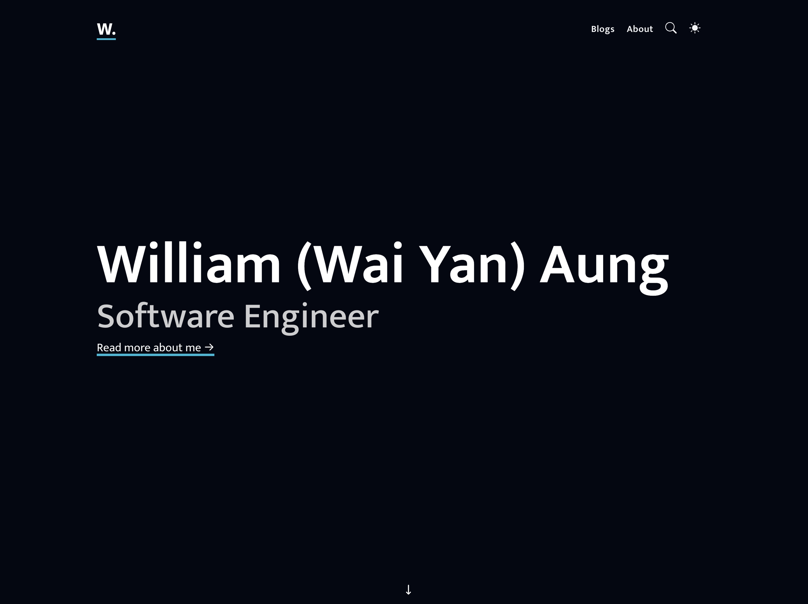

<div align="center">
  <h1 align="center">Personal Portfolio Website</h1>
</div>

This repository holds my personal portfolio blogging site built with Next.js, Tailwind, and Contentlayer. This is easily configurable and customisable. 

## Preview



## Tech Stack

- **Framework**: [Next.js](https://nextjs.org/)
- **Language**: [Typescript](https://www.typescriptlang.org/)
- **Deployment**: [Vercel](https://vercel.com)
- **Styling**: [Tailwind CSS](https://tailwindcss.com/)
- **Analytics**: [Vercel Web Analytics] (https://vercel.com/docs/analytics)
- **Content**: [Content Layer] (https://github.com/timlrx/contentlayer2)

### Tooling

Linting is an active part of the development process, the linting is activated `pre-commit` stage and is applied only on the **staged** files. This ensures that every new and changed file is validated against linting rules.

- [ESLint](https://eslint.org/)
- [Kusky](https://typicode.github.io/husky/) - To configure git hooks
- [lint-staged](https://github.com/lint-staged/lint-staged) - To lint only **staged** codes before committing code


Linting helps maintain a consistent coding style, catching errors early. `lint-staged` ensures that only the necessary files are linted, improving efficiency and preventing unwanted commits. This helps to maintain high code quality with minimal effort.

## Getting Started

### Prerequisites

Here's what you need to be able to run Papermark:

- [Node](https://nodejs.org/en/download/) version "Iron" (Node.js `20.x.x`).


### 1. Clone the repository

```shell
git clone git@github.com:wyaaung/portfolio-website.git
cd portfolio-website
```

### 2. Install npm dependencies

```shell
npm install
```

### 3. Run the dev server

```shell
npm run dev
```

### 4. Open the app in your browser

Visit [http://localhost:3000](http://localhost:3000) in your browser.
