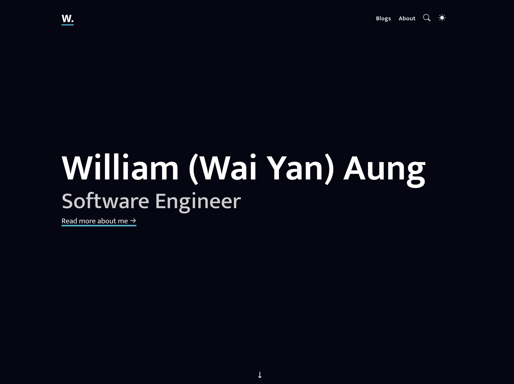

<div align="center">
  <h1 align="center">Personal Portfolio Website</h1>
</div>

This repository holds my personal portfolio blogging site built with Next.js, Tailwind CSS, and native MDX processing. This is easily configurable and customisable. 

## Preview



## Tech Stack

- **Framework**: [Next.js 16](https://nextjs.org/)
- **Language**: [TypeScript](https://www.typescriptlang.org/)
- **UI Framework**: [React 19](https://react.dev/)
- **Styling**: [Tailwind CSS](https://tailwindcss.com/)
- **Content Management**: Native [MDX](https://mdxjs.com/) processing with [@next/mdx](https://nextjs.org/docs/app/building-your-application/configuring/mdx)
- **Animation**: [Framer Motion](https://www.framer.com/motion/)
- **Smooth Scrolling**: [Lenis](https://lenis.darkroom.engineering/)
- **Command Palette**: [kbar](https://kbar.vercel.app/)
- **Analytics**: [Vercel Web Analytics](https://vercel.com/docs/analytics) & [Speed Insights](https://vercel.com/docs/speed-insights)
- **Deployment**: [Vercel](https://vercel.com)

### Tooling

Code quality and formatting are maintained through automated tooling that runs on pre-commit hooks, ensuring only staged files are processed for optimal efficiency.

- [Biome](https://biomejs.dev/) - Fast linter and formatter for JavaScript/TypeScript
- [Husky](https://typicode.github.io/husky/) - Git hooks management
- [lint-staged](https://github.com/lint-staged/lint-staged) - Run linting only on staged files before committing

Biome provides ultra-fast linting and formatting with zero configuration, replacing ESLint and Prettier. The pre-commit hooks ensure consistent code style and catch errors early, maintaining high code quality with minimal effort.

## Getting Started

### Prerequisites

Here's what you need to be able to run this portfolio website:

- [Node.js](https://nodejs.org/en/download/) version 20.11 or higher


### 1. Clone the repository

```shell
git clone git@github.com:wyaaung/portfolio-website.git
cd portfolio-website
```

### 2. Install npm dependencies

```shell
npm install
```

### 3. Run the dev server

```shell
npm run dev
```

### 4. Open the app in your browser

Visit [http://localhost:3000](http://localhost:3000) in your browser.
